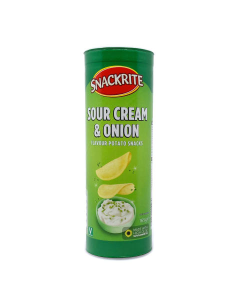

It is a debate my mother has been making for years. Whether to splash the cash at Waitrose or Tesco's or go for a bargain at Aldi. I can't even taste a difference between the products so it doesn't matter to me. What does stand out however is the fact that Aldi alters brands logos and makes them their own with ever so slight adjustments. This genius marketing tactic confuses shoppers on the daily as to whether they will be eating the real deal or not. I want to take a couple of my favourite foods from both Aldi and the original brands and see how the package style looks different. 

**Rich Teas**

*Mcvitie's*

The OG of all biscuits... MCVITIE'S. A delicious product, with a very good dunking consistency good for when you want to dip it in tea. As shown the brand is famous for its blue packaging. It reminds me of a royal blue, only adding to the effect that it is the ruler of biscuits. The font itself is very bold and white which only makes it stand out more. The text has a slight curve looking effect to the style, making it far classier than just plain straight lines. It reminds me of fonts similar to 'Lucinda Handwriting' or 'French Script'. Very fancy!

*Aldi*

At a first glance, you may argue that this is the same product as the original... You are wrong. These are in fact in a whole other league, Aldi league.   The product is almost identical to that of Mcvities. The shades of blue are pretty much the same yet on this packaging there is no gradient between the blue and white. The font as well, although incredibly similar, is far less classy than the Mcvities. Seems even to be a little bolder. In a way, this product looks a little cheaper with basic graphics shown eg of the teapot however from experience I can assure you both taste completely the same.  

**Sour Cream and Onion Crisps** 

*Pringles* 

By far my favourite crisps of all time has to be pringles. You'll see me sitting on the sofa in the corner snacking on a share can of these luxuries whilst everyone else is getting smashed. How can you not adore them! The logo itself is just iconic. It's weird how no one ever refers to pringles as crisps, it's simply just 'Pringles'. The Logo stands out in yellow and white. Yellow is usually associated with happiness and white meaning peace which is exactly how I feel whenever I have a can of these. The text Pringles is in the style of 'Bodega Sans Original'. It appears to be extremely bold with like the rich tea biscuits has slightly curved edges. Making it slightly fancy. It's a nice touch to also add the image of the face to the logo name as its easily memorable. The 'Sour Cream' text is less curved and slightly bolder. The fact the can is in green further adds to the idea of new and fresh which is exactly what the product is.

*Aldi*

Well... Aldi has only gone and done it again. The Aldi version of Pringles is almost an exact replica to the original. Instantly I noticed how the green colours are far less bold are more of a pastel shade compared to the original, yet still effective in being bold. There is however a large difference between the font style of the product. The Aldi style is far bolder with no curved lettering, just straight lines. Much like your classic font styles of 'New Times Roman' or 'Calibri'. 

**So Who Wins?**

Although a very strong effort from Aldi, unfortunately, the original packaging will always win in my eyes. For me, the colours are far bolder and I feel the originals focus far more on the product packaging in order to fit in whilst the market, whereas Aldi can afford to make cheaper packaging as their market tends to focus on cheapness rather than looks. Taste on the other hand is a whole other debate!