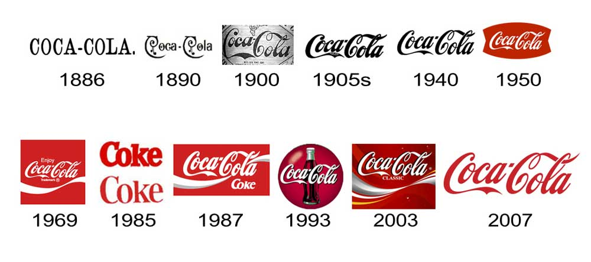

*Coca Cola* commonly refered to as *Coke.* Established in 1886, the brand is known not only for its unique taste but also the iconic logo. Over the years the taste and ingrediants of the product may ahve chnaged but the logo has remained the same. Lets take a look through time and see how the historical logo has changed.  

