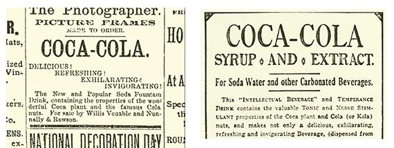
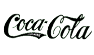
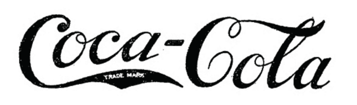
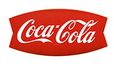
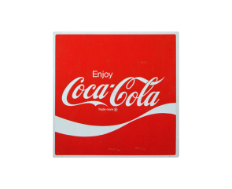
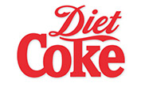
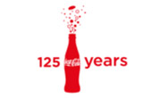

*Coca Cola* commonly referred to as *Coke.* Established in 1886, the brand is known not only for its unique taste but also for the iconic logo. Over the years the taste and ingredients of the product may have changed but the logo has remained the same. Let's take a look through time and see how the historical logo has changed.  

**1886 - 1887**

Before coke introduced its iconic, trademark logo the style was very basic. John Pemberton (the creator of coke) used a very basic font for the advertisement of the drink, similar to that of Calibri. 

 **1887 - 1893**

In 1887 Dr John Pemberton's bookkeeper, Frank Mason Robinson, designed the curvier font which we are familiar with today. The font is written in Spencerian Script, the dominant form of writing font within the USA at the time.

**1893** 

1893 was the year Coca Cola was granted from the patent office to have its first trademark. This was added to the lower swirl on the first C of the logo. It was shown upon the lower C for the next 50 years before the trademark sign was removed and displayed below the Coca Cola sign.

**1950s - 1960s**

The vibrant 'Fishtail' logo first appeared in 1958 and remained until the 1960s. The 'fishtail' design was used in order to make the logo stand out more and was more graphically striking. 

**1969**

Within the year 1969, the white wave was introduced to the logo. Sometimes referred to as a 'Dynamic Ribbon Device' the wave is still used upon the logo today. 

**1982**

In 1982 the famous 'Diet Coke' was created as a healthier version of the original coke. The word 'Diet' is branded with the Spencerian Script found on the original Coca Cola logos. The word 'Coke' is written in a similar font yet in bold and with no curved edges. 

**2011**

In order to signify the 125th Anniversary of Coke, a special design was made in order to celebrate the occasion. The traditional red remains a standard trademark for Coke.