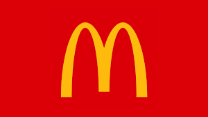
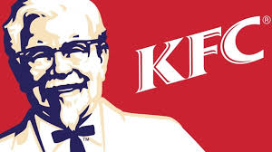
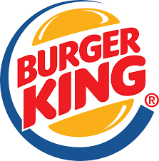
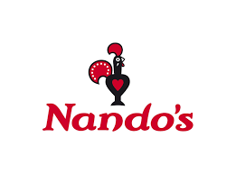

Fast-food chains have dominated the food industry for decades. In 2018 alone the fast food industry was worth $256 billion in 2018. What makes the fast food industry so iconic and memorable though is its famous Logos. From McDonalds to KFC each logo is memorisable throughout the world and attracts millions of visitors every year. 

**McDonalds**

Introduced in 1968 the McDonalds logo is famous throughout the world. The simple yet bold 'M' was designed by Jesse Burgheimer and is known as McLawsuit. The font itself is available in 99 characters and not in lowercase. The vibrant, contrasting colours of the red and yellow further attract the consumers attention. 

**KFC** 

KFC was famously founded by Colonel Harland Sanders within the year 1952. Colonel Sanders is iconic to the brand. To this day a smiling portrait of the Colonel is still found on all the companies logos. This sweet memorial for the founder prepares the visitors for a pleasant experience whilst also holding onto the principles first introduced by Colonel Sanders. The way in which he is coloured in white further portrays him in an angelic angle. 

The font style within the logo was designed by Victor Caruso, Ernst Friz and Thierry PuyFoulhoux and is known as Friz Quadrata. By having a white font against a red background not only matches with the image of the Colonel but also makes it stand out more with lighter against darker, solid tones. 

**Burger King** 

Burger King was first developed in 1953 by Kieth Kramer and Matthew Burns, under the name 'Insta-Burger'. The company was later brought in 1954 by James Mclamore and David Edgerton with its named being changed to 'Burger King'.

 In 1999 the logo that we see today was first introduced to the public. It was designed by Sterling Brands with a strong resembelence to the original design of Burger King in 1964. The logo design visulizes burger with the words 'Burger King' being sandwiched inbetween two buns. The font is very similar to the Insaniburger font family, first designed by Adam Nerland. 

**Nandos** 

The logo for nandos which we see today was designed in 2016 by South African consultancy Sunshinegun. The font has many connection to the South African culture. The lettering was styled by Marks Salimu who handpainted the original words upon wooden panels. The lettering was inspired by road signs within South Africa that have the same font. 

Nandos is known for its theme of red. The red is in fact inspired by peri-peri which is linked to the Chili-pepper. The deep shade of red was created specially by artist Manie Pietersn.