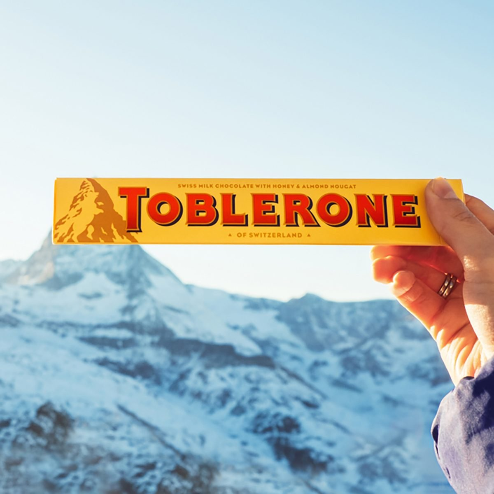
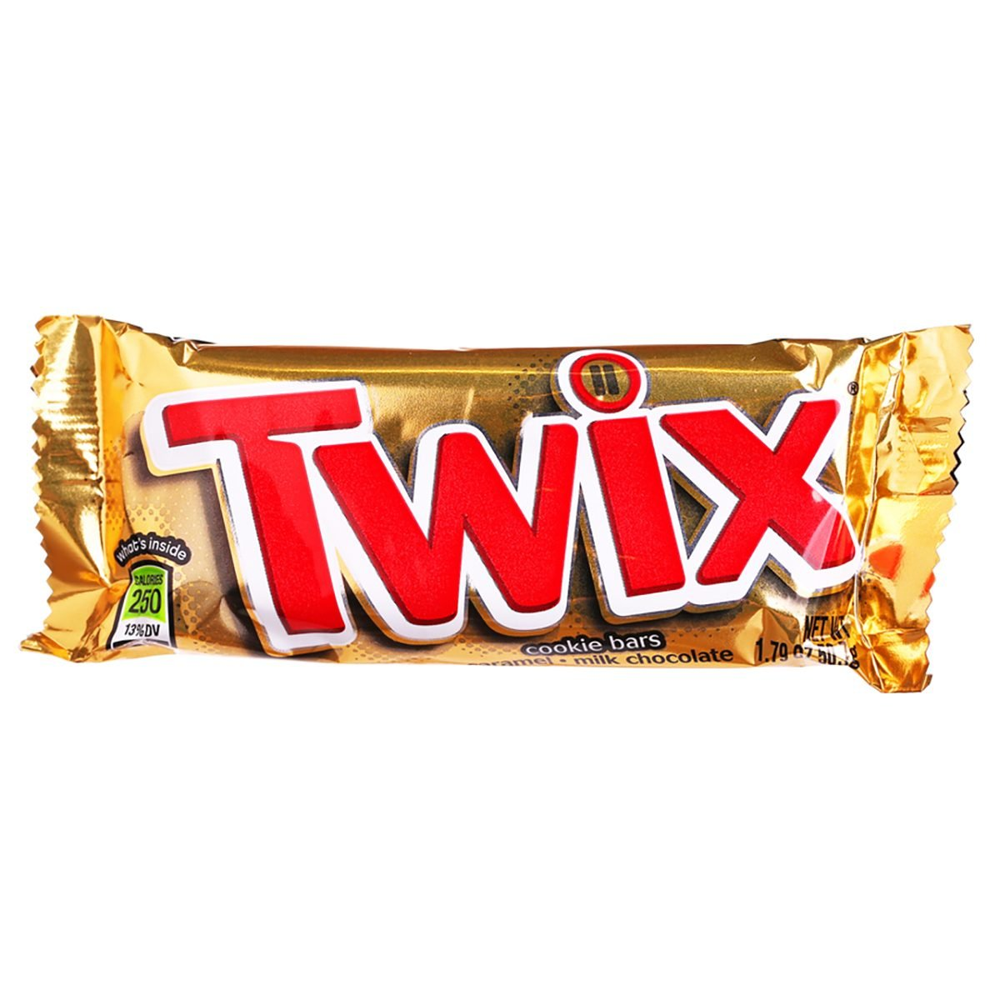
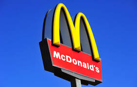

For years food brands have been hiding hidden symbols from us. The tactical marketing move is utterly brilliant and totally different from most brands on the market. Here are a few of those logos with some design secrets that will shock you all...

**TOBLERONE**

First developed in the Swiss town of Bern in 1908 the chocolate has become one of the most loved chocolates in the world. Legend has it that the town of Bern owes its name to the furry creature. The logo cleverly is associated with this by having a bear hidden in the mountain. 

**TWIX**

If you look closely you will notice two very small Twix's upon the I. This secret message is supposed to highlight the famous left and right Twix campaign. 

**MCDONALD'S**

The famous food brand logo has a very naughty message. It has been rumored that the two M's joining together supposedly highlights the maternal mother's breasts. This saucy marketing strategy is used to portray how the food at McDonald's is better than home-cooked food. 

**PEPSI**

**SUBWAY**